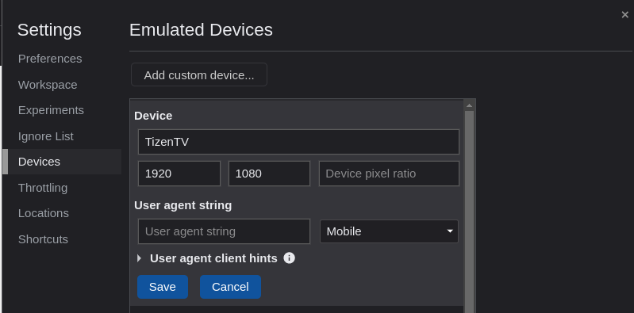
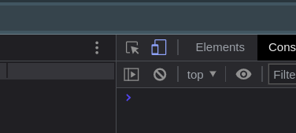
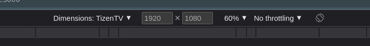

# Project template for [Tizen Web Apps](https://docs.tizen.org/application/web/index) based on ReactJS.

#### This template includes:

- [TypeScript](https://www.npmjs.com/package/typescript);
- [create-react-app](https://www.npmjs.com/package/create-react-app);
- [@craco/craco](https://www.npmjs.com/package/@craco/craco);
- [@tizen-tv/wits](https://github.com/Samsung/Wits);
- [ESlint](https://www.npmjs.com/package/eslint), [Prettier](https://www.npmjs.com/package/prettier), [StyleLint](https://www.npmjs.com/package/stylelint), [Editor config](https://editorconfig.org/), [husky](https://www.npmjs.com/package/husky) and [LintStaged](https://www.npmjs.com/package/lint-staged);

#### Related packages:
- [sass](https://www.npmjs.com/package/sass);
- [axios](https://www.npmjs.com/package/axios);
- [classnames](https://www.npmjs.com/package/classnames);
- [react-route-dom](https://reactrouter.com/en/main);
- [tizen-tv-webapis](https://www.npmjs.com/package/tizen-tv-webapis);
- [@noriginmedia/norigin-spatial-navigation](https://www.npmjs.com/package/@noriginmedia/norigin-spatial-navigation);

## Available scripts:

`npm start` - to start project in develompent mode;

`npm start:tv` - to start project in develompent mode remote on TV with hot reaload;

`npm run build` - to build project;

`lint:es:fix` - to fix JS and TS problems;

`lint:css:fix` - to fix CSS and SCSS problems;

## Configaration files:

`craco.config.ts` - for configuring __React__ application;

`tsconfig.json` - for configuring __typescript__;

`.witsconfig.json` - for configuring remote running and debugging;

`.eslintrc.json, .eslintrc-stage.json` - for configuring __ESLint__ for development and stage;

`.stylelintrc.json, .stylelintrc-stage.json` - for configuring __StyleLint__ for development and stage;

`.prettierrc` - for configuring __prettier__ for development and stage;

`.editorconfig` - for configuring __Editor config__;

## Development and debugging in browser:

1. Open `Developer tools`;

2. Create emulated device:
    
    - Go to `Developer tools` -> `Settings` -> `Devices`;
    - Press `Add custom device` button and create device with 1920 x 1080 resolution;
    > 

3. Enable `Toggle device toolbar`;
    > 

4. Select created device;
    > 

5. You are ready to development :)

## Development:

__Creating focusable components:__

### \<Focusable/>

For making component focusable use __`<Focusable/>`__ component. 

This component create focusable wrapper for you.

#### __`<Focusable>`__ component interface:

    interface IProps extends UseFocusableConfig {
	    as?: any;
	    className?: string;
	    focusedClassName?: string;
	    defaultFocused?: boolean;
	    children?: ReactNode | Array<ReactNode>;
	    style?: CSSProperties;
    }

__`as?: any`__ - specify this property to explicitly specify a __`tag`__ for the generated wrapper. 

> __Default:__ `"div"`.

>__Available:__ any `HTML5` tag specified as a `string`. If you want to specify a tag that doesn't require closing, use the following syntax: 

```
<Focusable as='img' />`
```

> __Don't use__ this ⬇️ syntax for unclosed tags( `img`,`hr` etc. ): 

```
<Focusable as="img">...</Focusable>
```

`className?: string` - `className` prop.

>__Default:__ `''`

`focusedClassName?: string` - `className` prop for focused element.

>__Default:__ `'focused'`

`defaultFocused?: boolean` - 
a property indicating whether the element will have focus on the first render.

>__Default:__ `false`

`style?: CSSProperties` - React `style` attribute.

`children?: ReactNode | Array<ReactNode>` - child nodes. Don't use this as prop.

`UseFocusableConfig?` - props for [`useFocusable`](https://github.com/NoriginMedia/norigin-spatial-navigation#usefocusable-hook) hook; 

### \<FocusableContainer/>

For making container focusable use __`<FocusableContainer>...</FocusableContainer>`__ component. 

This component create focusable container for you __`<Focusable/>`__ components.

#### __`<FocusableContainer>`__ component interface:

    interface IProps extends UseFocusableConfig {
	    as?: any;
	    children: ReactNode | Array<ReactNode>;
	    className?: string;
	    hasFocusedChildClassName?: string;
	    defaultFocused?: boolean;
	    style?: CSSProperties;
    }


__`as?: any`__ - specify this property to explicitly specify a __`tag`__ for the generated wrapper. 

>__Default:__ `"div"`.

>__Available:__ any `HTML5` closing tag specified as a `string`.

> __Don't use__ unclosed tags ( `img`,`hr` etc. ) for this component. 

`className?: string` - `className` prop.

>__Default:__ `''`

`hasFocusedChildClassName?: string` - `className` prop will be added  when container has focused children.

>__Default:__ `''`

`defaultFocused?: boolean` - 
a property indicating whether the element will have focus on the first render.

>__Default:__ `false`

`style?: CSSProperties` - React `style` attribute.

`children?: ReactNode | Array<ReactNode>` - child nodes. Don't use this as prop.

`UseFocusableConfig?` - props for [`useFocusable`](https://github.com/NoriginMedia/norigin-spatial-navigation#usefocusable-hook) hook; 

### \<FocusProvider />

This component wrapping you application and provides __`useFocusContext`__ hook.

__`useFocusContext`__ - hook take you possibility for managing focus in any component.

Hook output decribed [here](https://github.com/NoriginMedia/norigin-spatial-navigation#hook-output).

__Using:__

Call __`useFocusContext`__ in any place of your application. Hook return to you result decribed [here](https://github.com/NoriginMedia/norigin-spatial-navigation#hook-output).

- Use `setFocus` method to manually set the focus to a component providing its `focusKey`.

- Use `getCurrentFocusKey` method to get the currently focused component's focus key.

- Use `navigateByDirection(direction: string, focusDetails: FocusDetails)` method to manually navigation to a certain direction.

- Use `pause` method to pause all the key event handlers.

- Use `resume` method to resume all the key event handlers.
